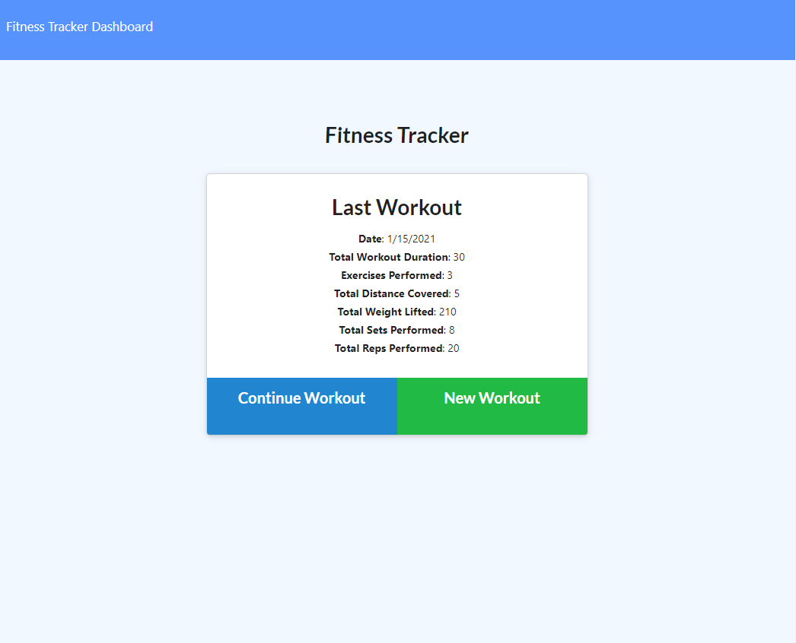
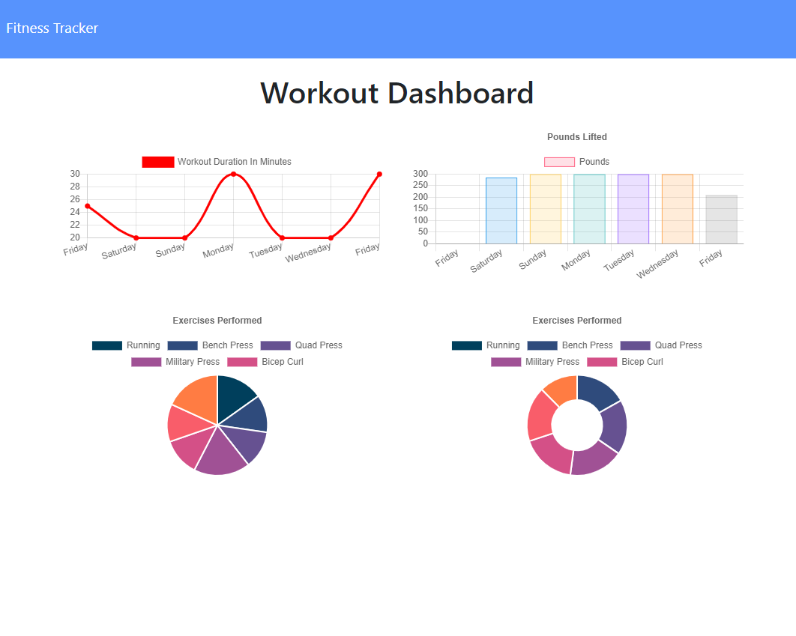

# Workout Tracker

Keep track of your daily workouts using this Workout Tracker!

## Table of Contents

1. [Usage](#Usage)
1. [Languages and Concepts](#Languages-and-Concepts)
1. [Demo](#Demo)
1. [Roadmap](#Roadmap)
1. [Links](#Links)
1. [Contact](#Contact)
1. [Contributing](#Contributing)
1. [License](#License)

## Usage

This application allows you to log your daily workouts, distinguishing between cardio and resistance workouts. You can add multiple exercises to your workout or start a new workout. You can view your weekly progress on the dashboard by both duration and weight lifted.

## Languages and Concepts

- [MongoDB](https://www.mongodb.com/)
- [Mongoose](https://mongoosejs.com/)
- [Morgan](https://www.npmjs.com/package/morgan)
- [Node.js](https://nodejs.org/en/)
- [Express.js](https://expressjs.com/)

## Demo

## Roadmap

After completing the back-end of this application, I found there were some bugs with the front-end. I would like to adjust the front-end code so that the pie and donut charts handle the information correctly by either showing the totals of each exercise from that week or display by day, which would show similar information to the charts above, but in a different format. I would also like the charts to group by day, so if someone were to do two separate workouts that day, it would show the total sum for that day rather than break it out into two data points of the same day. Then to further the functionality, I would like users to be able to visually see their previous workouts in a journal-style layout to be able to see the specifics of what they have done and then be able to plan out what they want to do for the following week. 

## Links

- [See it live]()
- [Project Repository](https://github.com/ncmarsh/workout_tracker)

## Contact

- Nicole Marshall - [@ncmarsh](https://github.com/ncmarsh)

## Contributing

This is a personal project; no contributions are required at this time.

## License

No license granted.

##### [Return to Top of Page](#Workout-Tracker)